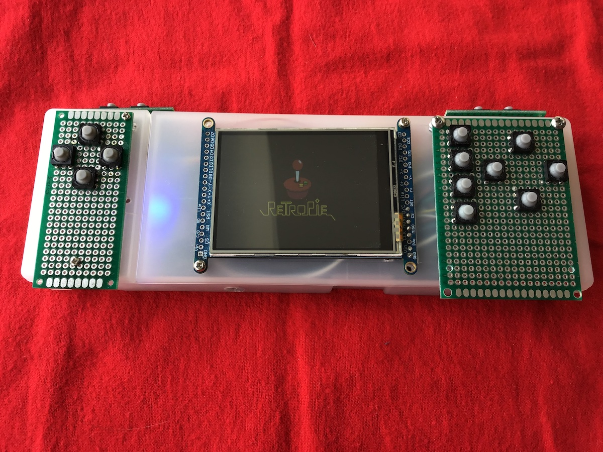
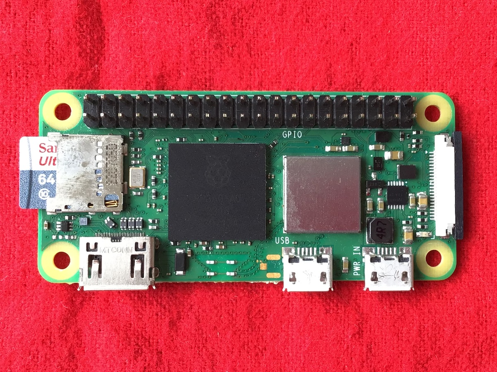
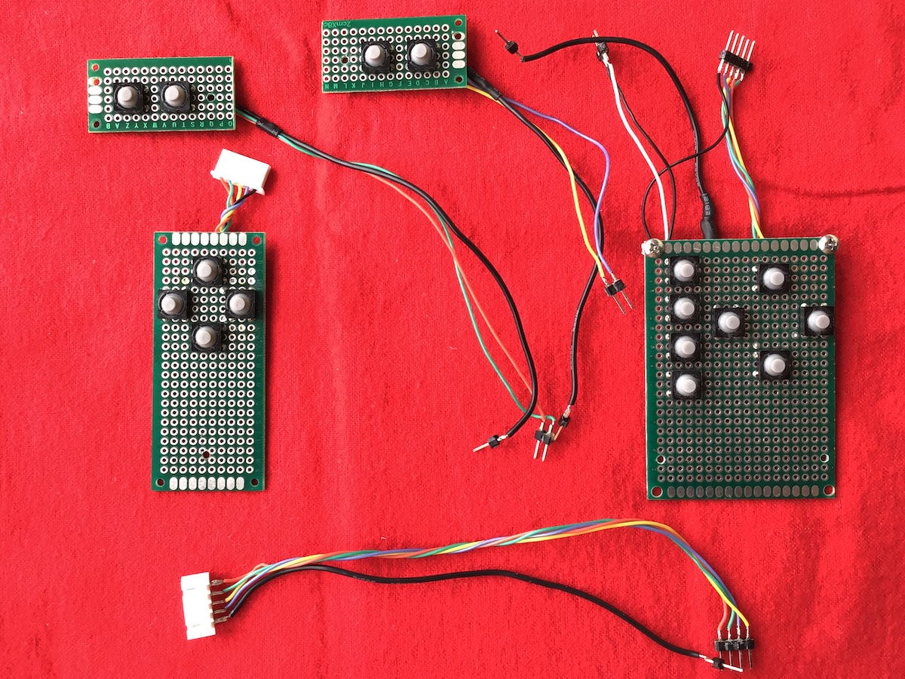
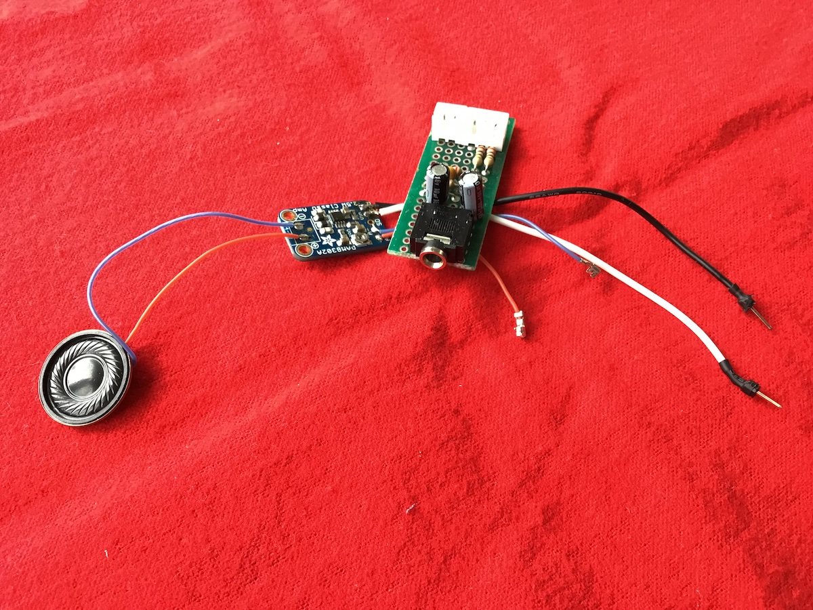
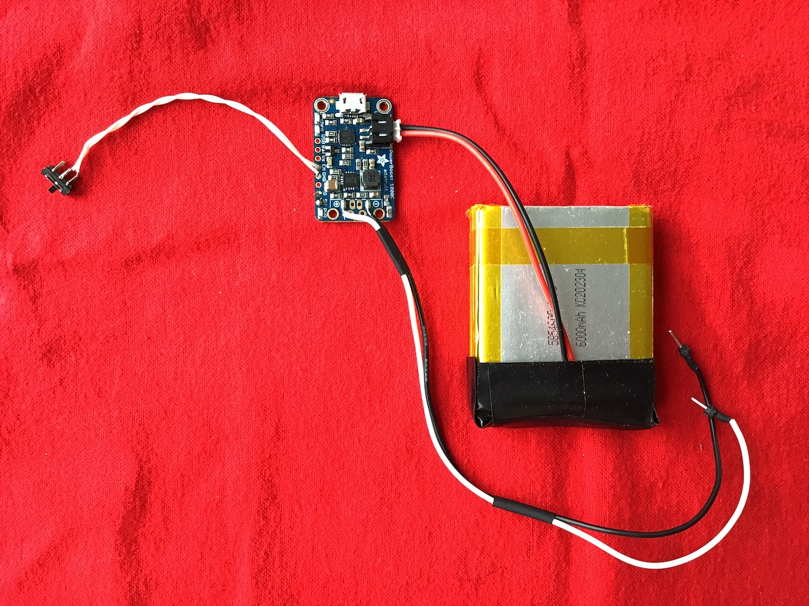
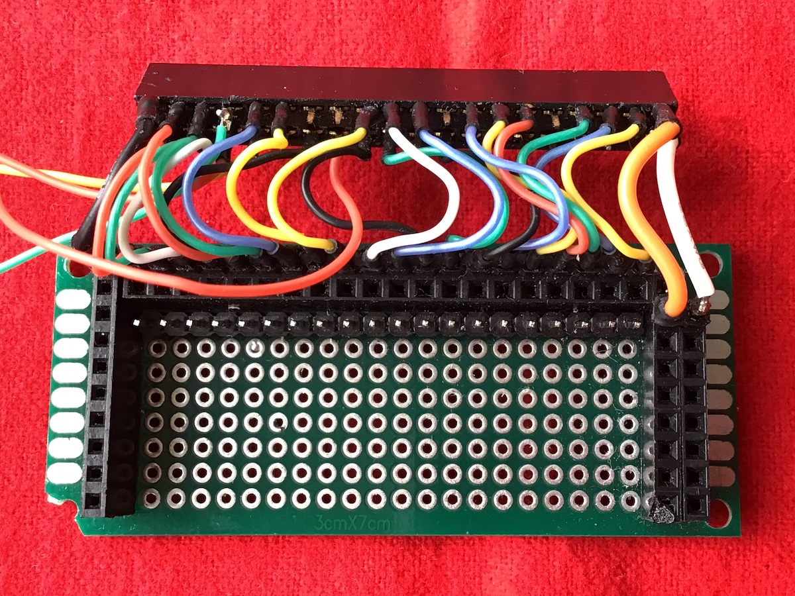
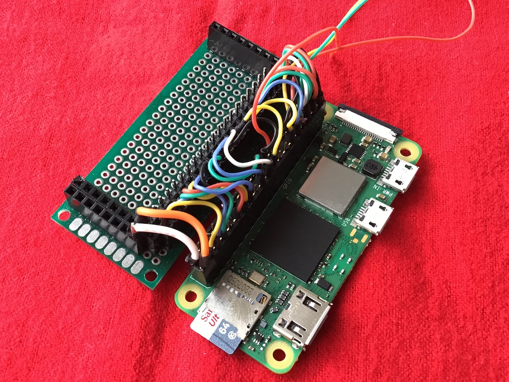
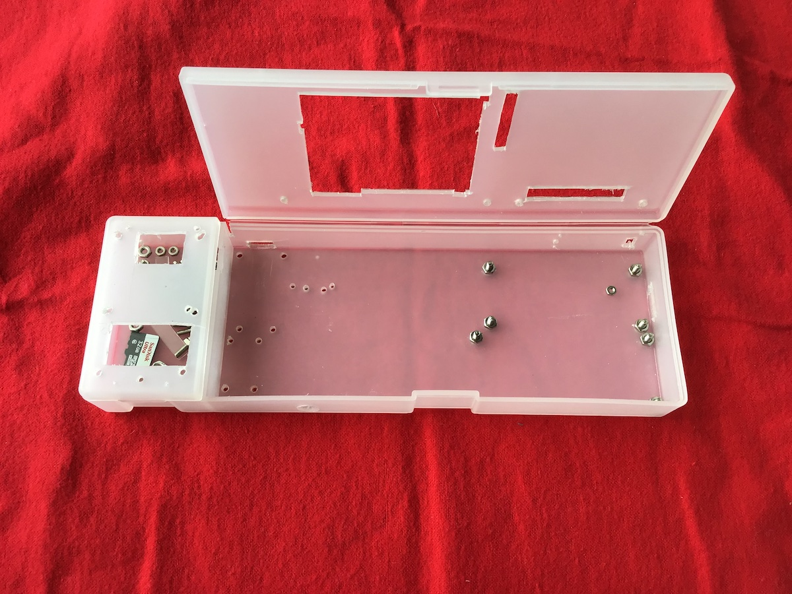

# Raspberry Pi Console

I have built my own portable gaming device powered by RetroPie on a Raspberry Pi!

## Contents

- [Goals](#goals)
- [Hardware Features](#hardware-features)
- [Software Features](#software-features)
- [Acknowledgements](#acknowledgements)

## Goals

The goal is to create a fully portable console that will run all of my favourite games from my childhood (most notably Crash Bandicoot, but also Rayman, Gran Turismo, and more) and take them with me on the go. RetroPie is capable of emulating retro consoles up to the PSX with relative ease on even the more modest currently available models of Raspberry Pi, which makes a perfect choice for this project.

I am trying to stick with a few guiding principles, in no particular order.
- **Originality** — I want the project to feel like a creation of my own, striking a balance between assembling a pre-designed kit and bending over backwards to reinvent solutions to well-understood problems.
- **Budget** — Keep the costs low.
- **Modularity and reusability of materials** — Wherever possible, limit permanent changes and connections on the hardware. That grants me some flexibility to change my design choices as I develop my project, and if at any point I decide to remove, replace, or upgrade a component this leaves me the option to repurpose the old part for some other project.
- **Low-tech tools** — No 3D-printing, laser-cutting, or CNC machining, at least for now. This is in small part because I don't have direct access to these tools, but more importantly I find value in the challenge of "doing it myself" with what I have lying around or I can find in a hobby store for low price. I am generally flexible about this though, but the rule of thumb is I want to have a working prototype version of the entire build before I make any 3D-printed upgrades. Etching my own PCBs is also something I have considered, except I don't trust myself with strong acids enough to take that chance. I do however plan to design my own PCBs and have them printed at a later stage.

## Hardware features

- **Raspberry Pi Zero 2W** — The brains of the operation. Adafruit's Pigrrl 2 project is based on a Raspberry Pi 2, although their [kit](https://www.adafruit.com/product/3014) and [tutorial](https://learn.adafruit.com/pigrrl-2/) are also compatible with the Raspberry Pi 3. For my project, I initially wanted to use a Raspberry Pi 4, significantly more powerful than its predecessors and practically the only model available for purchase in my region at the time (courtesy of the post-pandemic chip shortage). High performance, however, comes at the expense of portability, so I later decided to go with the Zero 2W instead — more modest, but still powerful enough to handle my "target" games.

- **2.8" TFT Display** — I used [this display](https://www.adafruit.com/product/1770) from Adafruit, featuring an ILI9341 driver and a convenient PCB that breaks out all the relevant terminals, notably the SPI connections. It also features an adjustable backlight and resistive touch screen. I might transition to the 3.2" version in the near future.

- **Digital controls** — Temporary push-buttons mounted on prototyping boards and connected to the Raspberry Pi via GPIO. In the current version I am using soft elastomer buttons similar to [these](https://www.adafruit.com/product/3101). Since I want to emulate PSX games, I have installed a total of 15 buttons: four directional, four actions, two for each shoulder, Start, Select, and one extra button as hotkey to activate special actions on RetroPie (access menus, exit current game, load/save state, change save slot...). There actually is one more button in the current build that I included for later use, but it is not currently connected to anything.

- **Audio jack and speaker** — Sound is not as readily available on the Raspberry Pi Zero series as on the larger models of the family, and some hardware tweaks are required to get it. For my build I put together a stereo RC filter that cleans sound before feeding it to a 3.5mm jack. I also included a 2.5W PAM8302 mono amplifier (once again, I got mine from [Adafruit](https://www.adafruit.com/product/2130)) connected to a small 8&#937; 0.5W speaker — the signal is automatically redirected here if nothing is connected to the jack.

- **Power circuit** — My project is powered by a 6000mAh LiPo through Adafruit's [PowerBoost 1000c](https://www.adafruit.com/product/2465). This circuit handles charging and discharging the battery and automatically switches to supplying power to the project from USB when available. This allows not only to reduce strain on the battery but also charge it while still powering the project, and to switch between battery and USB without loss of continuity. It also features a low-power LED as an added bonus. I soldered a slide switch to the enable pin to serve as a power switch for the entire device.

- **Internal breakout connector** — In the spirit of not soldering directly on the Pi, which came with pre-assembled pin headers for the GPIO, I used a prototyping board to break out all the pins that I need. The board features ground, 3V3, and 5V lines with convenient pin headers, as well as all the pins I needed to use for my project. Each line is soldered to a short wire that goes to the appropriate position on a 20x2 female pin header which then easily connects to the Pi without any soldering on it. This also has the benefit of rearranging the pin layout, so that pins destined to the same device (display, audio, group of near-by buttons) are grouped together.

- **Enclosure** — Rather than 3D-printing a case, I decided to enclose my project in a polypropylene [pencil case](https://muji.ca/products/pen-case-2-compartments) I got from Muji. While this solution does take a good amount of elbow grease to drill and cut all the necessary holes (and I am not yet as skilled at precise cuts as I wish), it's just about the right size for a handheld gaming device, comfortably fitting the 2.8" display and potentially a larger 3.2" as well. I get plenty of space for all the components and wires in my project and even some extra space for a few accessories to carry around. I am particularly satisfied with the somewhat "steampunk" look that my project got from the contrast between the minimalistic simple design of the case with the PCBs mounted on top of it.

## Software features

My project runs RetroPie on a Raspbian installation on Raspberry Pi. This can easily be obtained by burning the appropriate image on a micro-SD card, e.g. using the Imager app or following an online tutorial.

- **Controls** — The controls are driven by a program I wrote in C which reads GPIO digital inputs and translates them to virtual key presses. GPIO inputs are monitored using the libgpiod library, and virtual input events are generated by uinput, a Linux kernel module which allows the user to create a virtual device and simulate key events such as presses, releases, repetitions, and other kinds of digital or analog inputs. My code is loosely inspired by Adafruit's [RetroGame](https://github.com/adafruit/Adafruit-Retrogame), but it replaces the now deprecated sysfs GPIO interface with libgpiod, and simplifies some of the more complex features. More details can be found in [Controls](Controls/).

- **Display** — To drive the display I used Adafruit's [PiTFT installation script](https://raw.githubusercontent.com/adafruit/Raspberry-Pi-Installer-Scripts/master/pitft-fbcp.sh) with slight customization. By default, this display's device-tree overlay (which comes pre-installed in the Raspbian kernel) enables the touch screen and correspondingly blocks the Chip Select 1 pin for SPI0. Since I do not plan to use the touch screen for my project, but I might want to connect some other device through SPI0 or use the GPIO pin for something else, I have modified the `.dto` file to inhibit that feature.

- **PWM audio** - In order to get audio from the Raspberry Pi I also needed to re-route the sound to two PWM pins (GPIO 12 and 13). That is achieved by adding appropriate lines to the `/boot/config.txt` file.

## Acknowledgements

Huge thanks go to Francesco Guatieri, who frequently helped me with wisdom and advice throughout this project, with helpful suggestions on tools, techniques, and design choices.

This project was largely inspired by [Adafruit's Pigrrl 2](https://learn.adafruit.com/pigrrl-2/). I have great appreciation for Adafruit in general and for their effort towards making engineering accessible to all and to the open-source philosophy. I have also learned a lot from their tutorials, open-source code, and community; I am particularly grateful to those who helped me on the Adafruit forum, and above all Mike Stone for not only his extended guidance, but more importantly his encouraging words. All of Adafruit's resources are available online free of charge, and the best way to support them is to purchase their product. I am in no way affiliated to or sponsored by them, but I am really happy to support them.